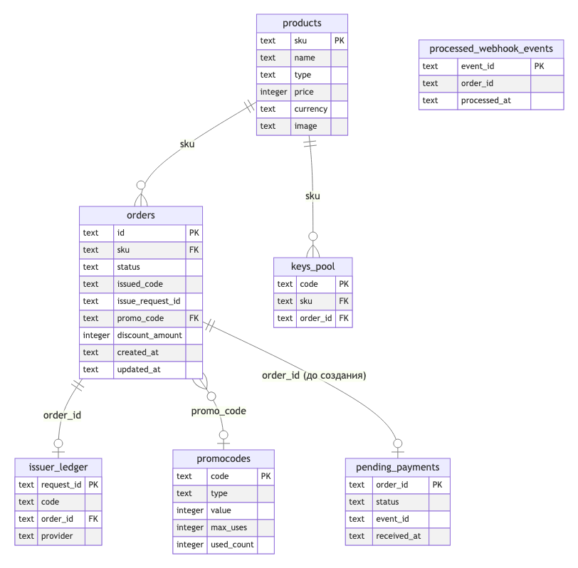
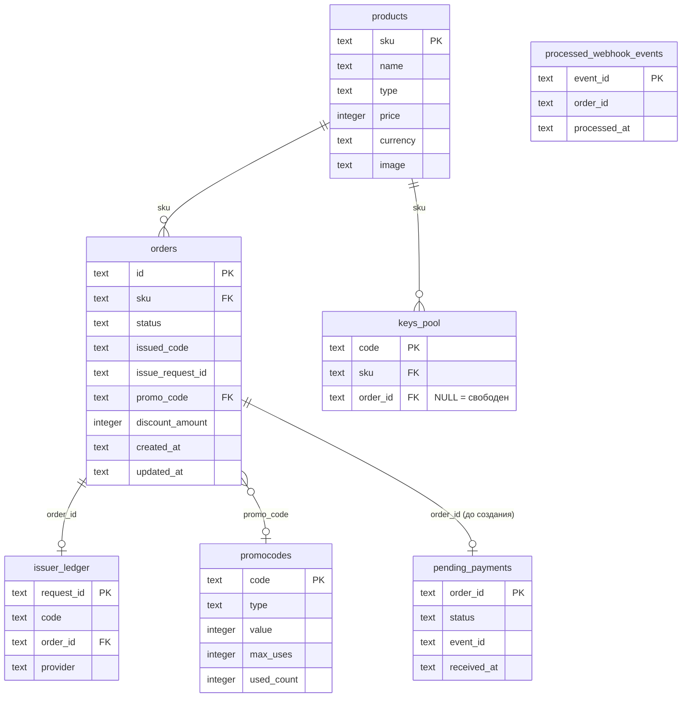

# Архитектура

Обзор того, как устроена надёжная выдача — ядро этого проекта. Быстрый
старт и результаты проверки гонок — в [README.md](README.md), здесь —
модель данных, состояние заказа и то, какие механизмы держат
корректность под параллельной нагрузкой.

## Что это

Магазин цифровых товаров (ключи активации, пополнения, подписки,
гифт-карты). Ядро системы — не витрина, а надёжная выдача: один заказ
должен получить ровно один код активации, даже если платёжная система
или внешний поставщик кодов ведут себя ненадёжно (дублируют
уведомления, теряют ответы, отвечают не по порядку, временно
недоступны).

## Стек и почему именно так

- **Node.js + Express** — тонкий HTTP-слой, ничего необычного.
- **better-sqlite3** — синхронная библиотека, не async-обёртка с
  колбэками/промисами вокруг нативного драйвера. Это не второстепенная
  деталь: код между началом и концом одного `db.prepare(...).run()`
  (или одной `db.transaction(fn)`) выполняется без переключения на
  другой запрос — event loop однопоточный, а вызов синхронный. Это и
  есть механизм, которым держится атомарность операций ниже, без
  ручных блокировок в приложении. При замене драйвера на асинхронный
  или переходе на другую СУБД часть гарантий идемпотентности нужно
  будет перепроверить отдельно — они не «случайно совпали», а прямо
  опираются на эту синхронность плюс на атомарные `UPDATE`/`INSERT`
  (см. «Идемпотентность» ниже).
- **SQLite вместо Postgres** — нулевая инфраструктура, разворачивается
  без Docker/отдельного сервера БД. `journal_mode = WAL` включён не
  ради корректности гонок (её дают атомарные `UPDATE`/`INSERT`), а
  чтобы читатель (внешний SQLite-браузер, админка) не блокировался о
  активную запись.
- **Vanilla JS на фронте** — без тяжёлых фреймворков, по требованиям
  задания.

## ER-диаграмма



<details>
<summary>Исходник диаграммы (Mermaid)</summary>



</details>

Полные комментарии по каждой таблице — `server/db/schema.sql`,
прокомментирован построчно с объяснением «зачем», не только «что».

| Таблица | Назначение | Ключевое поле |
|---|---|---|
| `products` | Статичный каталог | `sku` (natural key, не суррогатный id) |
| `orders` | Один заказ, state machine (см. ниже) + промокод | `id` (`ord_<uuid>`, генерируется сервером) |
| `promocodes` | Справочник кодов + счётчик применений | `code` PK; `used_count < max_uses` — атомарный гвард лимита |
| `keys_pool` | Коды активации, один код — один заказ | `code`; `order_id IS NULL` = свободен |
| `processed_webhook_events` | Дедуп вебхуков платёжки | `event_id` PK — сама вставка гасит повтор |
| `pending_payments` | Факт оплаты, пришедший раньше заказа | `order_id` PK, «последний известный факт» |
| `issuer_ledger` | Идемпотентность на стороне поставщика кодов | `request_id` PK — защита от «ловушки таймаута» |

Все внешние ключи включены (`PRAGMA foreign_keys = ON`), нарушить
целостность обычным путём через API нельзя.

## State machine заказа

```
created ──(payment webhook: paid)──► paid ──(claim)──► delivering ─┬─► delivered
   │                                                            ▲    ├─► out_of_stock ─┐
   └──(payment webhook: failed)──► payment_failed                \   └─► delivery_failed
                                                                   \                    │
                                              (admin retry, claim)  `────────────────────┘
```

Переходы `created→paid`, `created→payment_failed` и `{paid,
out_of_stock, delivery_failed}→delivering` — каждый отдельный
атомарный `UPDATE ... WHERE status IN (...)`. Если `changes === 0`,
значит заказ уже не в ожидаемом состоянии — код просто выходит, без
отдельной проверки статуса заранее (сам `UPDATE` и есть проверка — это
исключает окно между «прочитать статус» и «поменять статус», в котором
могла бы проскочить гонка).

`out_of_stock`/`delivery_failed` → `delivering` — восстановление после
сбоя: тот же самый `claimForDelivery`, что и `paid → delivering`,
просто с более широким `WHERE status IN (...)`. Не два разных перехода
с двумя разными гарантиями — один и тот же CAS-гвард обслуживает и
автоматическую доставку сразу после оплаты, и ручной повтор из админки
после пополнения пула.

## Идемпотентность — независимые атомарные шлюзы

Каждый — одна атомарная операция БД, ни одной блокировки на уровне
приложения:

1. **Событие вебхука** — `INSERT` с `event_id` как PK. Повтор того же
   события физически не может пройти дважды.
2. **Статус заказа** — `UPDATE ... WHERE status = 'created'`. Держит
   гарантию, даже если у 50 параллельных запросов 50 разных
   `event_id` (защищает не дедуп событий, а сам факт «один переход
   состояния»).
3. **Ключ из пула** — `UPDATE keys_pool SET order_id = ? WHERE
   order_id IS NULL` с подзапросом `LIMIT 1`. Занять один и тот же
   ключ дважды нельзя.
4. **Поставщик (ловушка таймаута)** — `issuer_ledger` проверяется
   первым шагом, до розыгрыша случайного отказа/таймаута. Поставщик в
   обеих ветках («успех» и «таймаут») реально выполняет выдачу,
   разница только в том, доходит ли ответ — поэтому повтор с тем же
   `request_id` возвращает уже выданный код, а не новый.
5. **Лимит промокода** — `UPDATE promocodes SET used_count =
   used_count + 1 WHERE used_count < max_uses`. Тот же класс гварда,
   что у пула ключей, только ресурс — не ключ, а место в лимите.

Плюс `pending_payments` — не про идемпотентность, а про **потерю**:
вебхук, пришедший раньше заказа, не теряется, а откладывается до
момента, когда заказ появится.

Один архитектурный нюанс, который легко объяснить неправильно: там,
где вся логика уже обёрнута в одну `db.transaction(fn)` (например,
применение промокода), финальный `UPDATE` внутри неё иногда всё равно
несёт свой `WHERE status = 'created'`, хотя формально избыточен —
`better-sqlite3` требует, чтобы тело транзакции было строго
синхронным (без `await`), а Node однопоточный, значит между первым
чтением и последней записью внутри одной транзакции физически не
может вклиниться другой запрос. Guard оставлен ради единообразия стиля
(«каждый мутирующий UPDATE сам себе guard») и на случай будущего
рефакторинга — не как единственная линия защиты.

## Восстановление после сбоя (админ-панель)

`server/routes/admin.js`, за простым токеном (`X-Admin-Token`):
список заказов «оплачен, не выдан» (`out_of_stock`/`delivery_failed`),
остатки по SKU, пополнение пула, ручной повтор выдачи. Повтор
идемпотентен тем же CAS-гвардом, что и автодоставка — параллельные
клики по «Повторить» на одном заказе дают ровно одну выдачу.
Фронтенд — отдельная нессылаемая страница `/admin.html`, дизайн
намеренно не проработан (задание для этой части его не требует).

## Промокоды под нагрузкой

`POST /orders/:id/promo {code}` — доступно, пока заказ ожидает оплаты.
Один промокод на заказ, без замены; скидку считает и хранит сервер
(`percent` округляется, `amount` клэмпится до цены товара — не уходит
в минус), клиенту не доверяет.

Если оплата заказа с применённым промокодом не проходит
(`payment_failed`) — слот лимита освобождается автоматически, тем же
атомарным `UPDATE ... used_count = used_count - 1`, в одной транзакции
с переводом заказа в `payment_failed`; `promo_code`/`discount_amount`
на заказе остаются как исторический факт. Освобождение сознательно
**не** происходит при `out_of_stock`/`delivery_failed` — там оплата
уже прошла, это восстановимое, а не отменённое состояние, и
освобождение слота параллельно с ручным повтором создало бы риск
задвоения уже по промокодам, а не по ключам.

Известное, сознательно нерешённое упрощение: заказ, который применил
промокод и был просто брошен без оплаты (не `payment_failed`, а
тишина), слот не освобождает — в системе вообще нет механизма
истечения заказов ни для чего.

## Осознанные упрощения — не баги, не недосмотр

- **`sku` как PRIMARY KEY в `products`**, не суррогатный id — каталог
  статичный и дан готовым в задании.
- **`keys_pool.order_id` не `UNIQUE`** — однократность выдачи держит
  код (`UPDATE ... WHERE order_id IS NULL`), а не ограничение схемы.
- **Рабочая выдача есть только у одного товара** — пул ключей в
  задании дан плоским списком без привязки к SKU, задание прямо
  разрешает флоу для одного товара. Остальные SKU в каталоге видны, но
  всегда получат `out_of_stock` — ожидаемое поведение, явно сообщается
  info-баннером на странице.
- **Оба поставщика (A/B) читают из одного `keys_pool`** — упрощение
  для проверки самой механики идемпотентности/fallback, в реальности у
  каждого было бы своё хранилище.
- **`POST /orders` не дедуплицирован** — двойной клик «Купить» создаёт
  два независимых заказа. Осознанно ок: ключ расходуется только при
  подтверждённой оплате, неоплаченный дубль-заказ пул не трогает.

## На что обратить внимание при изменении кода

- Не меняйте `better-sqlite3` на асинхронный драйвер без пересмотра
  раздела «Идемпотентность» — часть гарантий там опирается на
  синхронность вызовов.
- Не добавляйте проверку статуса заказа отдельным `SELECT` перед
  `UPDATE` «для ясности» — это воссоздаст check-then-act race, которого
  сейчас нет. Правильный паттерн — `UPDATE ... WHERE status =
  '<ожидаемый>'` и проверка `changes`.
- `deliverKey` идемпотентна на уровне заказа (безопасно вызывать
  повторно — на этом стоит и авто-доставка, и ручной повтор), но не
  параллельно с самой собой без прохождения через `claimForDelivery`.
